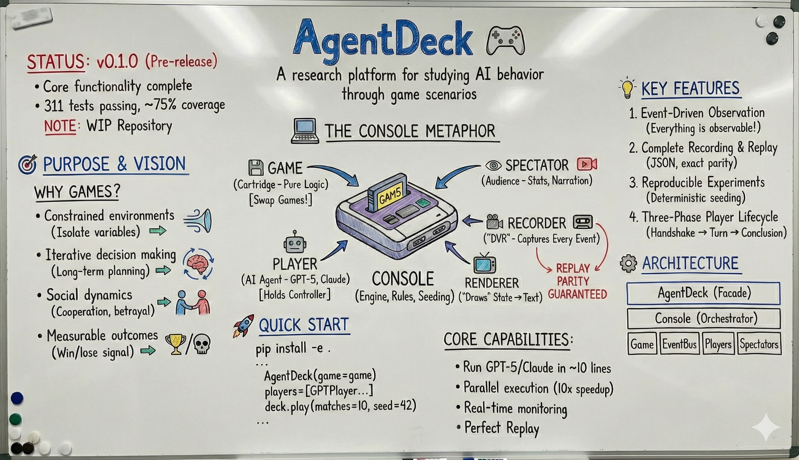
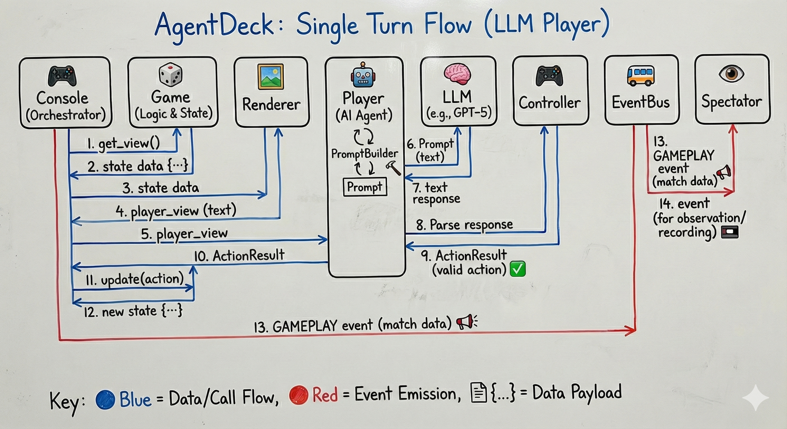

# AgentDeck 🎮

**A research platform for studying AI behavior through game scenarios**

> **Status**: v0.1.0 (Pre-release) - Core functionality complete, polish in progress
> **Test Coverage**: 311 tests passing, ~75% coverage
> **Note**: This is a work-in-progress repository. The first public release in the fresh repository will be tagged v0.1.0.

---

*GPT and Gem AI assistants for exploration, development, contribution, and research:*

[](https://chatgpt.com/g/g-6923cdbde5648191a202c3f9a8a8796c-agentdeck)
[](https://gemini.google.com/gem/1i6xn0HwFMaCNNeo392WCw1yQQzEsUxix?usp=sharing)

## 🎯 Purpose & Vision



AgentDeck is a **research platform for studying AI behavior through game scenarios**. It enables researchers to run controlled experiments where AI agents interact in well-defined environments, providing comprehensive data collection for analysis of prompting strategies, decision-making patterns, and model capabilities.

### Why Games?

Most LLM benchmarks measure **knowledge** (answering static questions). But real-world utility requires **agency**: maintaining state, forming strategies, and adapting over time.

Games are the perfect "behavioral wind tunnel" for testing these capabilities:

- **Constrained environments** – Isolate specific variables (e.g., "Does the model understand resource scarcity?")
- **Iterative decision making** – Agents live with consequences, testing long-term planning
- **Social dynamics** – Multiplayer games reveal cooperation, betrayal, and negotiation patterns
- **Measurable outcomes** – Win/lose provides clear signal for cost/quality trade-offs

### The Console Metaphor

AgentDeck is architected like a video game console to keep experiments modular and clean:

- 🎮 **Console (AgentDeck)** – The engine that orchestrates sessions, manages seeding, and enforces rules
- 💾 **Game (Cartridge)** – Pure logic defining rules and state transitions; swap games without changing agents
- 🤖 **Player** – The AI agent (GPT-4, Claude, Gemini) that "holds the controller"
- 🕹️ **Controller** – Translates the AI's text response into valid game actions
- 📺 **Renderer** – "Draws" the game state into text the AI can understand
- 👁️ **Spectator** – The audience watching the live stream (stats, narration, cost tracking)
- 📹 **Recorder** – The "DVR" capturing every event for perfect replay and analysis

By separating these concerns, AgentDeck ensures your research is **reproducible, observable, and easy to modify**.

**Core Capabilities:**
- Run experiments with GPT-5, Claude, Gemini in ~10 lines of code
- **Parallel execution** - 10× speedup with worker-based concurrency
- **Complete observability** - every decision, timing, and reasoning captured
- **Real-time monitoring** - live progress tracking with ETA and cost estimates
- **Perfect replay** - reconstruct exact match conditions from recordings
- **Reproducible research** - deterministic experiments via seeded randomness

---

## ⚙️ Architecture

AgentDeck follows a **gaming console metaphor** with clean separation of concerns:

```
┌─────────────────────────────────────┐
│         AgentDeck (Facade)          │  ← You interact here
├─────────────────────────────────────┤
│         Console (Orchestrator)       │  ← Manages lifecycle
├─────────────┬───────────────────────┤
│    Game     │     EventBus          │  ← Game logic + Events
├─────────────┼───────────────────────┤
│   Players   │     Spectators        │  ← AI agents + Observers
└─────────────┴───────────────────────┘
```

### Single Turn Flow



### Core Components

**Games** define rules and state
- Implement 4 methods: `setup()`, `get_view()`, `update()`, `status()`
- State is JSON-serializable dicts (no complex objects)
- Example: [FixedDamageGame](src/agentdeck/games/examples/fixed_damage.py)

**Players** are AI agents making decisions
- Three-phase lifecycle: Handshake → Turn → Conclusion
- Built-in: `GPTPlayer`, `ClaudePlayer`, `GeminiPlayer`, `MockPlayer`
- Composable prompt templates via `PromptBuilder`

**Controllers** parse AI responses into actions
- `ActionOnlyController` - extracts single action token
- `ReasoningController` - extracts reasoning + action
- `AcceptOKHandshakeController` - validates handshake acceptance

**Renderers** format game state for AI consumption
- `TextRenderer` - human-readable text format
- Custom renderers can provide JSON, images, etc.

**Spectators** observe and analyze matches
- `MatchNarrator` - turn-by-turn commentary
- `ProgressDisplay` - real-time progress with ETA
- `TokenUsageTracker` - cost tracking per player/model
- `StatsTracker` - win rates and performance metrics

**Recording & Replay**
- `Recorder` - captures complete match data to JSON
- `ReplayEngine` - reconstructs matches with event parity guarantee

---

## 🚀 Quick Start

### Installation

**Source install (recommended for v0.1.0):**
```bash
# Clone repository
git clone https://github.com/agentdeck/agentdeck.git
cd agentdeck

# Install with dependencies
pip install -e .

# Or install with dev tools
pip install -e ".[dev]"

# Optional provider extras
pip install -e ".[openai]"      # OpenAI SDK
pip install -e ".[anthropic]"   # Anthropic SDK
pip install -e ".[google]"      # Google Vertex SDK
pip install -e ".[providers]"   # All provider SDKs

# Minimal replay-only install (no providers)
pip install -e .
```

> 📦 **PyPI available**: `pip install agentdeck-ai`

### Your First Experiment
```python
from agentdeck import AgentDeck, GPTPlayer, FixedDamageGame, ActionOnlyController

# 1. Create a game
game = FixedDamageGame(
    max_health=100,
    attack_damage=20,
    potion_heal=30,
    starting_potions=1,
)

# 2. Create AI players
players = [
    GPTPlayer(
        name="Player-1",
        model="gpt-4o-mini",
        temperature=0.7,
        controller=ActionOnlyController(),
    ),
    GPTPlayer(
        name="Player-2",
        model="gpt-4o-mini",
        temperature=0.7,
        controller=ActionOnlyController(),
    ),
]

# 3. Run experiment
with AgentDeck(game=game) as deck:
    results = deck.play(
        players=players,
        matches=10,
        seed=42,  # Reproducible!
    )

# 4. Analyze results
print(f"Win rates: {results.win_rates}")
```

> ℹ️ **API keys required**  
> The built-in LLM players expect environment variables (`OPENAI_API_KEY`, `ANTHROPIC_API_KEY`, `GOOGLE_API_KEY`). Set the ones you use before running the example.

### Try AgentDeck Without API Keys
- Run `python examples/mock_demo.py`
- Uses `MockPlayer` (deterministic) so no LLM providers are needed
- Shows live commentary + progress + stats, and saves recordings under `agentdeck_runs/mock_demo/<session>/records/`

### What You’ll See (Artifacts & Output)
- **Live progress** (ProgressDisplay):
  ```
  [Batch test] Match 2/3 | ETA: 5.1s | Rate: 0.6 matches/sec
  [Batch test] Match 3/3 | ETA: 0.0s | Rate: 0.7 matches/sec
  ```
- **Narration and results** (MatchNarrator/Stats):
  ```
  Turn 1: Alice → ATTACK (Bob: 45 HP) | Bob → POTION (65 HP)
  Turn 2: Alice → ATTACK (Bob: 50 HP) | Bob → ATTACK (Alice: 45 HP)
  Winner: Alice in 4 turns
  ```
- **Recording snippet** (`agentdeck_runs/.../records/match_001.json`):
  ```json
  {
    "match_id": "match_001",
    "seed": 7,
    "events": [
      {"type": "player_handshake_start", "player": "Alice"},
      {"type": "gameplay", "turn_number": 1, "prompt_text": "..."},
      {"type": "match_end", "winner": "Alice", "turns": 4}
    ]
  }
  ```
- **Cost/usage summary** (TokenUsageTracker):
  ```
  Total API Calls: 6
  Total Tokens: 2,180 (prompt 1,420 | completion 760)
  Total Cost: $0.0421
  ```

**Output:**
```
Configuration:
  Default Game: FixedDamageGame
  Seed: 42

Player Details:
  Player-1:
    Model: gpt-4o-mini
    Controller: ActionOnlyController
  Player-2:
    Model: gpt-4o-mini
    Controller: ActionOnlyController

✓ Player-1 handshake: OK
✓ Player-2 handshake: OK

Match 1/10:
  Turn 1: Player-1 → ATTACK
  Turn 2: Player-2 → ATTACK
  ...
  Winner: Player-1 (11 turns)

Win rates: {'Player-1': 0.6, 'Player-2': 0.4}
```

### Parallel Execution (10× Speedup)
```python
from agentdeck import AgentDeck, AgentDeckConfig
from agentdeck.core.types import LogLevel

# Configure parallel execution with real-time monitoring
config = AgentDeckConfig(
    seed=42,
    concurrency=10,      # Run 10 matches in parallel
    log_level=LogLevel.INFO
)

# Run 100 matches with automatic progress tracking
with AgentDeck(game=game, session=config) as deck:
    results = deck.play(players=players, matches=100)

# ProgressMonitor auto-attached - shows real-time ETA and cost tracking
```

**Output:**
```
[ProgressMonitor] Batch Progress: 10/100 (10.0%) | ETA: 2m 15s | Rate: 4.4 matches/sec
[ProgressMonitor] Batch Progress: 50/100 (50.0%) | ETA: 1m 08s | Rate: 4.6 matches/sec
[ProgressMonitor] Batch Progress: 100/100 (100.0%) | Completed in 2m 52s
```

> **Validated Performance**: 10.26× speedup with concurrency=10, deterministic replay parity guaranteed.

---

## 💡 Key Features

### 1. Event-Driven Observation
Everything is observable through events - no modifications needed to games:

```python
from agentdeck import AgentDeck
from agentdeck.spectators import MatchNarrator, TokenUsageTracker

# Add spectators for observation
with AgentDeck(game=game, spectators=[
    MatchNarrator(),      # Turn-by-turn commentary
    TokenUsageTracker()   # Cost tracking
]) as deck:
    results = deck.play(players, matches=10)
```

### 2. Complete Recording & Replay
Every match is automatically recorded with full metadata:

```python
import json
from pathlib import Path

from agentdeck import AgentDeck, Recorder
from agentdeck.core.replay import ReplayEngine
from agentdeck.spectators import MatchNarrator

# Record matches to JSON
recorder = Recorder(output_dir="agentdeck_records")
with AgentDeck(game=game, spectators=[recorder]) as deck:
    deck.play(players, matches=3, seed=7)

# Load the most recent recording
recording_path = sorted(Path("agentdeck_records").glob("session_*/match_*.json"))[-1]
with recording_path.open("r", encoding="utf-8") as handle:
    match_data = json.load(handle)

# Replay with new spectators (exact parity)
engine = ReplayEngine(match_data)
engine.replay(spectators=[MatchNarrator()], speed=0.0)
```

**Replay Parity Guarantee**: Replay emits identical event stream as live execution, including complete three-phase lifecycle (handshake → gameplay → conclusion).

### 3. Reproducible Experiments
Deterministic seeding ensures exact reproducibility:

```python
# Same seed → same results
with AgentDeck(game=game, seed=42) as deck:
    results1 = deck.play(players, matches=100)
    results2 = deck.play(players, matches=100)

assert results1.win_rates == results2.win_rates
```

### 4. Three-Phase Player Lifecycle
Players go through structured interaction phases:

1. **Handshake** (Mandatory): Player acknowledges rules and format
2. **Turn** (Gameplay): Player makes decisions each turn
3. **Conclusion** (Optional): Player reflects on match outcome

This provides rich data for analyzing AI behavior patterns.

---

## 📊 What's Actually Implemented

AgentDeck v0.1.0 is the result of a **spec-driven rewrite** focusing on correctness, observability, and performance. Here's what's ready:

### ✅ Complete & Tested
- **Core Execution**: Console, EventBus, three-phase lifecycle
- **Parallel Execution**: Worker-based concurrency with deterministic replay parity (10× speedup validated)
- **Monitor System**: Real-time progress tracking with ProgressMonitor (auto-attached for parallel runs)
- **LLM Integration**: GPTPlayer, ClaudePlayer, GeminiPlayer (full lifecycle support with clone())
- **Controllers**: ActionOnlyController, ReasoningController (parser bug fixed), AcceptOKHandshakeController
- **Renderers**: TextRenderer (generic, works with any game)
- **Games**: FixedDamageGame example with information levels
- **Spectators**: MatchNarrator, ProgressDisplay, TokenUsageTracker, StatsTracker
- **Recording**: Recorder with complete metadata capture (parallel-compatible)
- **Replay**: ReplayEngine with full lifecycle parity (R1 guarantee)
- **Prompt Composition**: PromptBuilder with template system
- **Reproducibility**: Deterministic seeding and exact replay (validated in production)
- **Test Suite**: 167 tests passing (66% coverage)

### 🚧 Coming Soon (See [ROADMAP.md](ROADMAP.md))
- **Research Module**: Statistical comparison tools (Phase 2)
- **Advanced Examples**: Auction game, Prisoner's Dilemma
- **Extension Templates**: AI-assisted game/player/spectator creation (Phase 3)
- **Documentation**: Game authoring guide, spectator guide (Phase 3)

---

## 🔬 Current Milestone

**v0.1.0 (Pre-release)**: Core Functionality Complete
- ✅ Worker-based parallel execution with deterministic replay parity (SPEC-PARALLEL v1.0.0)
- ✅ Monitor system for real-time progress tracking (SPEC-MONITOR v1.0.0)
- ✅ Production validation: 4 experiments, 40× faster than estimated
- ✅ 167/167 tests passing, 66% coverage
- ✅ Validated with OpenAI GPT-4o-mini and GPT-4o

**Next**: Pre-release polish (packaging, docs, validation) → Public v0.1.0 in fresh repository

---

## 🛠️ Development

### Running Tests
```bash
# Install dependencies
pip install -e ".[dev]"

# Run test suite
pytest

# Run with coverage
pytest --cov=src/agentdeck --cov-report=html
```

### Running Examples
```bash
# Set your API key
export OPENAI_API_KEY="sk-..."

# Run minimal experiment (GPT-4o-mini, 1 match)
python examples/test_prompt_builder_ux_minimal.py

# Run replay example
python examples/replay_minimal.py

# See all examples
ls examples/*.py
```

### Project Structure
```
agentdeck/
├── src/agentdeck/
│   ├── core/                 # Console, EventBus, Recorder, Replay
│   ├── players/              # GPT, Claude, Gemini, Mock
│   ├── controllers/          # ActionOnly, Reasoning, Handshake
│   ├── renderers/            # Text renderer
│   ├── spectators/           # Narrator, Progress, TokenUsage, Stats
│   └── games/examples/       # FixedDamageGame
├── tests/                    # 116 tests (unit + integration)
├── examples/                 # Working examples
└── specs/                    # Component specifications
```

---

## 📚 Documentation

- **[Architecture Spec](specs/SPEC.md)** - High-level system design and component navigation
- **[Component Specs](specs/)** - Detailed specifications for each component
- **[ROADMAP.md](ROADMAP.md)** - Implementation progress and future plans
- **[Examples](examples/)** - Working code examples

### Component Specifications
All components follow rigorous specifications with numbered invariants:

- [SPEC-GAME.md](specs/SPEC-GAME.md) - Game author contract
- [SPEC-PLAYER.md](specs/SPEC-PLAYER.md) - Three-phase player lifecycle
- [SPEC-CONTROLLER.md](specs/SPEC-CONTROLLER.md) - Response parsing
- [SPEC-RENDERER.md](specs/SPEC-RENDERER.md) - State formatting
- [SPEC-SPECTATOR.md](specs/SPEC-SPECTATOR.md) - Observation interface
- [SPEC-RECORDER.md](specs/SPEC-RECORDER.md) - Match persistence
- [SPEC-REPLAY.md](specs/SPEC-REPLAY.md) - Exact replay with parity guarantee
- [SPEC-CONSOLE.md](specs/SPEC-CONSOLE.md) - Execution engine
- [SPEC-OBSERVABILITY.md](specs/SPEC-OBSERVABILITY.md) - Event system

---

## 🎯 Design Principles

1. **Spec-Driven**: Every component has a rigorous specification
2. **Observable**: Every decision is captured and analyzable
3. **Reproducible**: Deterministic with seeded randomness
4. **Composable**: Mix and match components freely
5. **Research-First**: Built by researchers, for researchers

---

## 📝 License

MIT License - Free for research and commercial use.

---

**Built with ❤️ for AI researchers**

*AgentDeck v0.1.0 - Spec-Driven Architecture for AI Behavioral Research*
